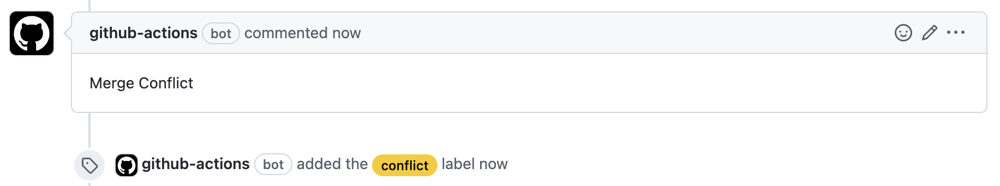

# auto-comment-merge-conflicts

> Github Action to automatically add a comment (and a label) to alert developers when there are merge conflicts

## Purpose

This action checks all unlocked open Pull Requests for merge conflicts and add a comment (and a label) if need. When a conflict is resolved the comment (and the label) is automatically removed.



## Usage

```
name: Auto Comment Merge Conflicts
on: push

permissions:
  pull-requests: write

jobs:
  auto-comment-merge-conflicts:
    runs-on: ubuntu-latest
    steps:
      - uses: codytseng/auto-comment-merge-conflicts@v1
        with:
          token: ${{ secrets.GITHUB_TOKEN }}
```

### List of input options

| input        | description                                                   | required | default        |
| :----------- | :------------------------------------------------------------ | :------: | :------------- |
| token        | GitHub token                                                  |   true   |                |
| comment-body | Comment body                                                  |  false   | Merge Conflict |
| wait-ms      | Milliseconds between retries                                  |  false   | 3000           |
| max-retries  | The number of retries when a PR mergeable status is `UNKNOWN` |  false   | 5              |
| label-name   | Label name                                                    |  false   |                |

### List of output options

| input               | description                                   |
| :------------------ | :-------------------------------------------- |
| new-conflicting-prs | List of all new conflicting PRs (json string) |
| new-mergeable-prs   | List of all new mergeable PRs (json string)   |

The type of PR:

```
{
  id: string;
  number: number; // Identifies the pull request number.
  title: string; // Identifies the pull request title.
  url: string; // The HTTP URL for this pull request.
  headRefName: string; // Identifies the name of the head Ref associated with the pull request, even if the ref has been deleted.
  baseRefName: string; // Identifies the name of the base Ref associated with the pull request, even if the ref has been deleted.
}
```

## How does it work?

1. Get all unlocked open PRs. (Will wait `${wait-ms}` ms and retry if it contains a PR with `UNKNOWN` mergeable status.)
2. If the mergeable status of PR is `CONFLICTING` and this PR has no `${comment-body}` comments, a `${comment-body}` comment will be automatically added.
3. If the mergeable status of PR is `MERGEABLE` and this PR has a `${comment-body}` comment, the comment will be automatically removed.
